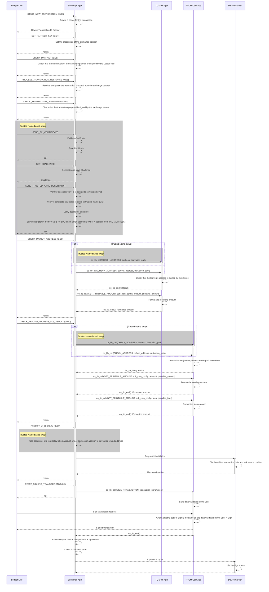

# Flow

```mermaid
sequenceDiagram
    participant LL as Ledger Live
    participant EA as Exchange App
    participant TOCA as TO Coin App
    participant FRCA as FROM Coin App
    participant DS as Device Screen

    LL->>EA: START_NEW_TRANSACTION (0x03)
    activate EA
    activate EA
    EA-->>EA: Create a nonce for the transaction
    EA-->>LL: Device Transaction ID (nonce)
    deactivate EA

    LL->>EA: SET_PARTNER_KEY (0x04)
    activate EA
    EA-->>EA: Set the credentials of the exchange partner
    EA-->>LL: return
    deactivate EA

    LL->>EA: CHECK_PARTNER (0x05)
    activate EA
    EA-->>EA: Check that the credentials of the exchange partner are signed by the Ledger key
    EA-->>LL: return
    deactivate EA

    LL->>EA: PROCESS_TRANSACTION_RESPONSE (0x06)
    activate EA
    EA-->>EA: Receive and parse the transaction proposal from the exchange partner
    EA-->>LL: return
    deactivate EA

    LL->>EA: CHECK_TRANSACTION_SIGNATURE (0x07)
    activate EA
    EA-->>EA: Check that the transaction proposal is signed by the exchange partner
    EA-->>LL: return
    deactivate EA

    rect rgb(200, 200, 200)
    note right of LL: Trusted Name based swap
    LL->>+EA: SEND_PKI_CERTIFICATE
    EA->>EA: Validate Certificate
    EA->>EA: Save Certificate
    EA-->>-LL: OK
    LL->>+EA: GET_CHALLENGE
    EA->>EA: Generate and save Challenge
    EA-->>-LL: Challenge
    LL->>+EA: SEND_TRUSTED_NAME_DESCRIPTOR
    EA-->>EA: Verify if descriptor key_id is equald to certificate key id
    EA-->>EA: Verify if certificate key usage is equal to trusted_name (0x04)
    EA-->>EA: Verify descriptor signature
    EA-->>EA: Save descriptor in memory (e.g. for SPL token, token account's owner = address from TAG_ADDRESS)
    EA-->>-LL: OK
    end

    LL->>+EA: CHECK_PAYOUT_ADDRESS (0x08)
    alt Trusted Name swap
    rect rgb(200, 200, 200)
    note right of EA: Trusted Name based swap
    EA->>TOCA: os_lib_call(CHECK_ADDRESS, address, derivation_path)
    activate TOCA
    end
    else
    EA->>TOCA: os_lib_call(CHECK_ADDRESS, payout_address, derivation_path)
    end
    TOCA-->>TOCA: Check that the [payout] address is owned by the device
    TOCA-->>EA: os_lib_end(): Result
    deactivate TOCA
    EA->>+TOCA: os_lib_call(GET_PRINTABLE_AMOUNT, sub_coin_config, amount, printable_amount)
    TOCA-->>TOCA: Format the receiving amount
    TOCA-->>-EA: os_lib_end(): Formatted amount
    EA-->>-LL: return

    LL->>+EA: CHECK_REFUND_ADDRESS_NO_DISPLAY (0x0C)
    alt Trusted Name swap
    rect rgb(200, 200, 200)
    note right of EA: Trusted Name based swap
    EA->>FRCA: os_lib_call(CHECK_ADDRESS, address, derivation_path)
    activate FRCA
    end
    else
    EA->>FRCA: os_lib_call(CHECK_ADDRESS, refund_address, derivation_path)
    end
    FRCA-->>FRCA: Check that the [refund] address belongs to the device
    FRCA-->>EA: os_lib_end(): Result
    deactivate FRCA
    EA->>+FRCA: os_lib_call(GET_PRINTABLE_AMOUNT, sub_coin_config, amount, printable_amount)
    FRCA-->>FRCA: Format the sending amount
    FRCA-->>-EA: os_lib_end(): Formatted amount
    EA->>+FRCA: os_lib_call(GET_PRINTABLE_AMOUNT, sub_coin_config, fees, printable_fees)
    FRCA-->>FRCA: Format the fees amount
    FRCA-->>-EA: os_lib_end(): Formatted amount
    EA-->>-LL: return

    LL->>+EA: PROMPT_UI_DISPLAY (0x0F)
    rect rgb(200, 200, 200)
    note right of LL: Trusted Name based swap
    EA-->>EA: Use descriptor info to display token account owner address in addition to payout or refund address
    end
    EA->>+DS: Request UI validation
    DS-->>DS: Display all the transaction data and ask user to confirm
    DS-->>-EA: User confirmation
    EA-->>-LL: return

    LL->>EA: START_SIGNING_TRANSACTION (0x0A)
    activate EA
    EA->>FRCA: os_lib_call(SIGN_TRANSACTION, transaction_parameters)
    activate FRCA
    EA-->>LL: Ok
    deactivate EA
    FRCA-->>FRCA: Save data validated by the user
    LL->>FRCA: Sign transaction request
    FRCA-->>FRCA: Check that the data to sign is the same as the data validated by the user + Sign
    FRCA-->>LL: Signed transaction
    FRCA-->>EA: os_lib_end()
    deactivate FRCA
    EA-->>EA: Save last cycle data: Coin appname + sign status
     EA-->>EA: Check if previous cycle
    EA-->>DS: if previous cycle
    activate DS
    DS-->>DS: display sign status
    DS-->>EA: 
    deactivate DS
    deactivate EA
    
```