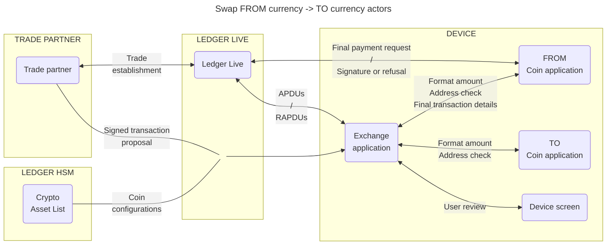

# Ledger Swap documentation

This documentation is designed to help you understand how the **Ledger Swap** feature works and to guide you through modifying your coin application to be compatible with it.

The **Swap** feature enables users to securely exchange one cryptocurrency for another directly from their Ledger device, within Ledger Live. It uses a trusted, multi-step process to facilitate communication between **Ledger Live**, the **Trade Partner**, the **Exchange application**, and the respective **Coin applications** on the device.

Built with robust security at every stage, the process includes cryptographic validation and transaction signatures. Final confirmation is conducted directly on the device screen, ensuring that only validated transactions are signed and authorized.

## Key Components of the Swap Flow

The Swap process involves the following actors:

- The **Trade Partner**: Proposes a trade offer to the Ledger Live user, which must be clearly displayed on the device screen by the Exchange application.
- The **Ledger Live**: initiates and manages the transaction flow between the Partner and the Exchange application.
- The **Exchange Application**: serves as the intermediary between the Ledger Live, the involved coin applications, and the user.
- The **Coin Applications**: Handle the processing for both the **FROM** and **TO** currencies involved in the swap.
- The **Ledger Crypto Asset List (CAL)**: Contains HSM-signed data of all SWAP-compatible currencies that help the Exchange application display the transaction proposal content on screen. 

