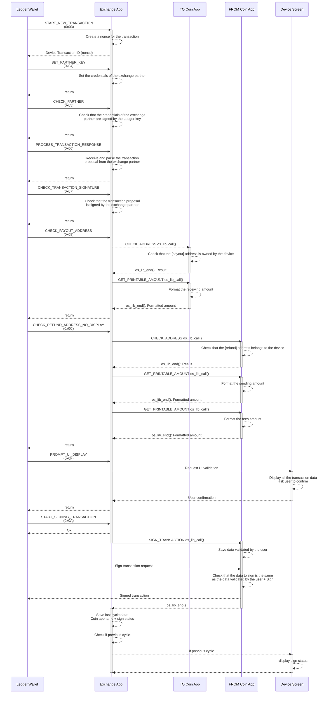

# Sequence diagram of a SWAP

This diagram showcases:

- The APDU and RAPDU exchanged between the Ledger Wallet and the Exchange application during a SWAP.
- The `os_lib_calls` commands made by the Exchange application to the involved Coin applications. 

Please look at the [protocol documentation](./protocol.md) to know more about how the APDUs content.

The FUND and SELL flows are not described as they are only subsets of the SWAP flow.
